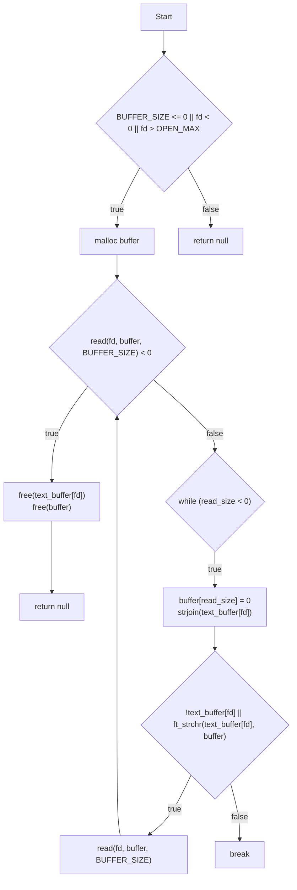

# Get Next Line (GNL) 이란?

우선 함수를 작성하기 전에 어떻게 작동해야하는지 알아야 한다
이해를 위해서 한번 main문을 작성 해보자

```
[test.txt]
aaa
bbb
ccc
ddd
```

이라는 내용을 갖은 파일이 있다고 가정해보자

```c
#include <unistd.h>
#include "get_next_line.h"

int main()
{
    int     fd;
    char    *line;

    fd = open("./test.txt", O_RDONLY);
    while((line = get_next_line(fd)))
    {
        printf("%s", line);
    }
    return (0);
}
```

그러면 우리는 get_next_line 함수를 이용해서 한줄 한줄을 출력 할수 있다

```
[output]
aaa
bbb
ccc
ddd
```

우선 이 프로그램이 어떻게 작동하는지 알기 위해서는 static 키워드에 대한 이해가 필요하다

# Static (정적) 변수

정적 변수를 사용하는 방법은 아주 쉽다

```c
static int num;
```

앞에 **static** 키워드를 붙여주면 끝이다

특징들을 한번 알아보자

- 초기값을 지정하지 않으면 기본으로 0으로 초기화 된다
- 함수를 벗어나도 변수는 사라지지 않으며, 프로그램이 시작될때 할당되고, 종료 될때 해제된다

사실 이번 과제는 static 키워드에 대한 이해를 했다면, 절반 이상 한것이다

# BUFFER_SIZE

우리는 주어진 BUFFER_SIZE 만큼 read 함수를 이용해 읽어야 한다

```
[test.txt]
aaa
bbb
ccc
ddd
```

다시 위와 같은 파일이 있고, BUFFER_SIZE가 1이라면?
a, a, a \\n, ... 이런식으로 읽고
aaa\\n 까지 출력해야 한다

만약 BUFFER_SIZE가 100이라면?
한번에 다 읽고
aaa\\n 까지 출력하고,
static으로 선언한 text_buffer에 파일 뒷부분의 내용을 넣어놓아야 한다

# Flowchart



# 마지막으로

망망대해를 향해가고 있는 42 여러분, 같이 힘내봐요!
\- soulee😊
