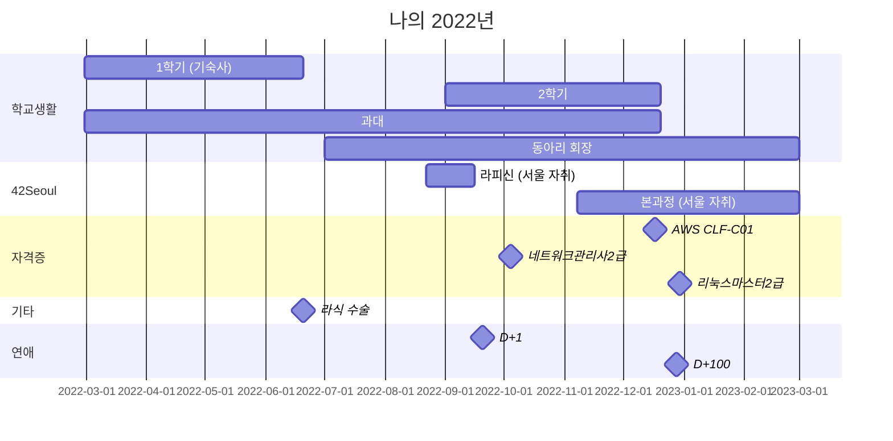

# 실화를 기반으로 한 스토리
기억 안나는게 많지만, 구글 캘린더와 내 아이클라우드를 기반으로 재현한 실화다.  
눈물 없이는 볼수 없는 휴먼 스토리.

# 입학전

알바를 하면서 학원을 다녔다.
알바는 지금 아니면 하지 못할거라고 생각했다.
그렇게 아는 카페에서 카페 알바를 했었다.
탁구장을 만드는 노가다 아닌 노가다도 해보고, 고깃집 알바도 해보고 많이 했었다.
고등학교때 수학을 손 놓다보니, 대학교에 가서 미적분이 어려울것 같아서 학원을 다니며 미적분 수업을 들었다.
고등학교때는 음주가무 하며 놀줄 알았는데 아니였다.
친구가 없어서 그랬나 ㅎㅋㅋㅋ
그리고 어머니가 양도해주신 PT는 꾸준히 다녔다.
주식도 열심히 했다. 특히 코로나때 열심히 사둔 테슬라가 엄청 올랐다.
분교로 와서 본캠으로 가고싶었다. 소속변경 말이다.

## 2월

카페 알바는 계속 하면서 이제 슬슬 바빠지기 시작했다.
42서울 체크인 미팅도 진행하고, 대학 입학전이라 그런지 바빠졌다.
드디어 등록금을 냈다. 사실 장학금을 받았다. 전액.

고등학교 친구들이랑 부산도 다녀오고 재미있게 놀았다.

네트워크 관리사 2급 필기도 땄다.

첫 기숙사.

학교 들어오고 처음으로 먹은 음식.
나는 학교에 가보고 싶어서 남들보다 일찍 학교에 갔다.
2월 28일, 기숙사에 처음 들어오고 아무것도 없는 그곳에서 자는건 불편했다.

# 첫 개강, 3월

생각이 참 많아졌다. 나는 생각이 많을떄 자전거를 많이 탔다. 그렇게 자전거를 타고 세종 정부청사로 향했다. 무슨 생각이었는진 기억 안나지만, 개강 하고 느낀건 막막함이었던것 같다. 앞으로 뭘 해먹고 살아야 하나.
그리고 갑자기 서울에 살고 싶었다. 어릴때부터 동경해왔는데, 20살이 되고 이제 실천에 옮기고 싶었다.
아마 그렇게 방황하며 일주일 내내 서울에 올라갔던것 같다.

몸이 안좋아서 코로나 검사를 받으러 갔는데, 코로나에 걸렸다.
아마 개강 후 술 먹으면서 집단 감염... 이 일어났던것 같았다.

못해먹겠는 수업들.

내 첫 선거는 대선이었다. 법이 바뀐덕에 나도 참정권을 행사할수 있었다. 이사 온지 얼마 되지 않아서 엄청 먼 투표소로 잡혔다. 그런데 아뿔싸, 신분증을 놓고왔다. 코로나 환자들은 시간에 제한이 있는데, 급하게 집에 가서 신분증을 갖고오고 투표를 마쳤다.

정수론 과제하는데 나는 수학을 몰라서 외국인한테 물어봤다. 지금이야 ChatGPT가 있어서 쉽게 물어봤겠지만..

애플페이 한다고 생 난리를 쳤다. 결국엔 Wise로 해외계좌(?)를 만들었다. 내 명의는 아니고 핀테크 회사 명으로 나가는거 같다.
처음으로 한강에서 라면을 먹어봤다. 이게 한강 라면이구나.

친구랑 실컷 놀고 친구는 서울에 있는 집에 들어갔는데, 나는 혼자 집이 없었다.
그땐 비가 참 많이 왔다. 나는 비가 정말 좋았다. 결국에는 엄청 비를 맞고 들어갔지만.
아무튼 나도 서울에 집이 있고 싶었다. 참 서러웠다.
운동도, 학부연구생도, 수학도, 다 해보고 싶었다. 아마 이때 과대를 시작했을거다.
스물다섯 스물하나 참 인기 많았는데 나는 이런 감성 잘 몰라서 안봤다. 정확히는 보다 말았지.

기숙사 근황.

글쓰기 수업.

부동산 알아보기. 세종에 전세라도 하나 사고 싶었다.
영어 스피킹 동아리도 갔다. 근데 술 먹고 노느라 잘 안갔다.
과대라고 내가 과잠도 만들었다.

징그러워.

할아버지 어머니랑 같이 옆동네 제천 드라이브 갔다왔다. 사진은 엄마가 조수석에서ㅓ 팔 뻗고 찍어줬다.

부동산 욕심..

쉬운 과제들...

> 점점 집에 대한 갈망이 커져갔었다.
> 기숙사와 통금이라는 시간적 제약과, 서울이 아니라는 공간적 제약이 힘들었다.
> 마침 주식도 잘 됐다 싶어서 집을 보러 다녔었다.

## 만우절의, 4월
위랑 똑같이 술 많이 먹었다.
그리고 부동산도 많이 보러 다녔다. 모로 가도 서울로 가라고.
나는 그중에서도 강남 불패 신화를 믿었다. 내가 살수 있는 돈으로는 빌라, 오피스텔이 최선이었다.

강남 구석 구석을 정말 많이 돌아다녔다. 강남 주민들도 모를만한 곳도 임장한다고 엄청 다닌것 같다. 저 위에 내 집이 하나 있다. 어디인지는 비밀.

개구쟁이였다.

술 먹었다.
영어 스피킹 동아리도 좀 다녔다. 같이 회식도 가고.
4월부터 스케이트 보드를 시작했다.
동기들이랑 세종 시내도 다녀왔다.

주식 세금도 내봤다.
3, 4월은 캘린더에 얼마 안적어 놓은거 보면 하루하루 벅차게 산거 같다.
아직도 기억나는게, 처음 들어간 기숙사는 공용 화장실이었다. 그런데 단열이 잘 안되는지, 아침마다 샤워할때 엄청 추웠다. 그렇게 추운곳에서 샤워하면서 든 생각은, 비참하기만 했다.
정말 많은 사람을 만났다. 특히나 술 먹으면서 많이 만났다.

낭만있는 풀밭 돗자리 점심도 먹어봤다.

볼링도 쳤는데 나는 진짜 못쳤다. 지금도 못치고, 공 관련된 운동은 끔찍하다.

이때도 인공지능이 핫했다. 특히 생성형 인공지능 달리.

비 오는 상황에서 그냥 맞았다. 왜지.
아마 나는 악조건? 에서 버티는걸 멋있다고 생각한것 같다. 남들과는 다르니까.
그리고 결국엔 집을 계약했다. 강남구 모처에 부동산을 드디어 산것이다. 무언가 한 걸음 앞으로 간것 같아 좋아다.

내 꿈이다. 초등학교때부터 같은 꿈이었다.

기숙사로 전입신고 했다. 세금을 덜 내기 위해서이다. 편법은 아닌데 귀찮아서 안해오던걸 드디어 했던거다. 진짜다. 오해금지.

물 대신 소주를 준다는 그 잔디밭에 또 누웠다.

사실 이렇게 하고도, 나는 정말 많은 생각이 들었나보다. 또 자전거를 타러 갔다. 나는 수업들이 다 마음에 안들었다. 수학은 너무 어렵고, 프로그래밍과 영어는 너무 쉬웠다. 참 의기양양했다. 학교는 마음에 안들었다. 나는 원래 초등학교떄부터 프로그래밍을 시작하고, 중학교때부터 영재원을 다니며 해킹을 했다. 그리고 내가 들어온 곳도 보안 학과였다. 그런데 커리큘럼은 내가 생각했던것과 많이 달랐다. 많이 방황했다. 나쁜짓 하고 다니진 않았지만, 앞으로 뭘 해야할지 막막했다.
스케이트 보드 동아리를 친구들과 만들었다. 새로운 사람도 만나고 진짜 재밌었다.
또 야무지게 술 먹고 놀러다녔다. 그것이 내 캘린더가 텅 비어있는 이유이다.
나는 진짜 자전거를 좋아한다. 그래서 기숙사에 자전거를 가져다 놨다. 그런데 생각보다 안탔다. 결국 4월 말이나 되어야 타게됐다. 또 생각이 많아졌다.
내가 자전거를 많이 타면 생각을 많이 한거다.
부동산 1차 잔금을 다 치뤘다.
그리고 망할 신검을 다녀왔다. 3급이 나왔다 참 애매하게.
고향 친구들이랑 같이 학교에 놀러왔다. 재밌게 놀았다 참.

> 성인이 되고 나서 하고 싶은것은 많았다.
> 내 꿈에 비해서 지금 나의 모습은 정말 보잘것 없었다.
> 그렇게 내가 느낀 감정은 압박감이었고, 학교에 정을 붙일수 없었다.

## 처음으로 간 코스트코와 함께, 5월
점점 구글 캘린더에 일정이 많아지고 있다.
아마 가장 큰 이유는 일정 관리가 힘들었기 떄문이다. 나는 하루에 약속을 여러개 잡았다. 워낙 일정이 많다보니 나도 헷갈렸고, 친구들에게 미안했다.
처음으로 코스트코를 갔다. 이게 미국 스케일이구나. 신기하다.
또 자전거를 타러 나갔다. 세종 시내로 가고싶었는데, 비가 와서 가다가 돌아왔다.
세종 시내까지는 자전거로 1시간정도 소요된다.
동기들이랑 충주에 왔다. 슈퍼비랑 언에듀가 우리 동네에 왔거든.
담배도 꽤 피웠다. 왜 피는지 알거 같더라.

처음으로 놀러 대구에 갔다.
예전에 영재원에서 KERIS 대구 보안센터 견학 이후 처음이다. 생각해보니까 영재원에서 국정원 견학도 갔었다. 신기했는데.
가서 친구들을 만났다.
참 정신없이 이곳 저곳 갔다. 대구, 충주, 서울, 세종.
엄청 시끄러운 술집도 갔다. 재미있었다.
어쩌다 노원구까지 갔다.
그리고 또 자전거. 노원에서 강남까지. 또 생각이 많았다. 그리고 살다 살다 처음으로 노숙을 했다.
첫 버스가 올때까지 공원에서 모기와의 혈투끝에 고속터미널에서 집으로 돌아갈수 있었다.
지금 생각해보면 나는 학교 기숙사를 다니면서도 매주 본가로 내려갔었다.
아는 형이랑 서대문에 신라스테이를 갔다. 진짜 재미있었다. 아직도 그 화채는 못잊겠다.
또라이 모먼트가 나왔다. 학교 기숙사 앞에 있는 분수대에 빠졌다. 완전 관종이다.
친구가 생겼다. 기숙사 구름다리에서 만날수 있었다.
차 복이 생겼는지 어쩌다 차를 많이 얻어탈수 있었다. 차 뽕이 생겨서 보험료를 계산해봤는데 1150만원이라 때려쳤다.
엠티를 다녀왔다. 나는 사실 그때만 해도 학교에 정이 없어서 그런지, 참 방황했다.
그래도 좋은 친구가 생겨서 좋았다.
청주에 가서 호미들 콘서트를 보고왔다 재미있더라. 근데 다음날이 입실렌티였다. 술먹고 일어났는데 아직도 어떻게 학교 축제 버스를 탔는지 모르겠다.
학교 축제는 진짜 재미있었다.
고양에 친한 친구 생겨서 엄청 좋았다.
그리고 고양에서 또 자전거를 탔다. 또다. 이제는 말 안해도 알겠지?

> 나는 내가 참 미웠다.
> 무언가 강박적으로 변하고 싶었다.
> 부동산을 시작으로, 후술할 라식, 42서울 변화의 첫 걸음이였다.

## 스케이트보드, 6월

엄청 자주 넘어졌다.
스케이트 보드 동아리 회식을 했다.
친구라 영화도 보러다녔다. 신입생은 티켓 1+1 이벤트를 해거든.

킹받네
결국 스케이트 보드 타고다니다 애플워치 깨먹었다.
다음에는 울트라로 사야겠다.
또 자전거. 이번에는 새벽이다. 얼마나 생각할게 많았으면...
친구랑 대구를 다시 갔다.
새로운 사람들을 많이 사겼다. 그리고 오랜만에 대구 친구들 얼굴도 보고.
또 최초로 디팡도 탔다.

대구가서 산 내 첫 스케이트 보드.
42서울 라피신 하기 전, 방학동안 서울에 살아보고 싶어서 이곳 저곳 알아보다가, 서울 첫 자취하는 사람들이 많이 산다는 서울대입구역에 방을 잡았다. 단기라 그런지 엄청 비쌌다. 100에 70만원.
너무 만연체로 쓴건 미안하다.
그래도 같은 동네에 고향 친구가 있어서 좋았다.
국세청에서 편지가 왔다. 마음 조리며 열었는데, 세금 환급금이랜다.
처음으로 조치원 시장에 가봤다. 맛있는 닭강정.

나는 생각보다 귀여운걸 좋아하는것 같다.
살다 살다 내 돈을 내고 마사지를 받아보는건 처음이다. 그래도 돈이 좋다. 아는 형이랑 둘이 발, 등 각각 12만원 나왔다.

이떈 서울이 지겹지 않았지.
또 놀고 먹고 자고, 아마 이때가 돈을 가장 많이 쓴거 같다. 돈도 없는데 한달에 백만원은 썼나?

결국 라식을 하러 왔다. 검사 수술 당일에 다 된다고 한다.
비용은 엄청나지만 지금 와서 생각해보면 가장 잘한 선택중 하나였다.
수술 과정은 별거 없다. 초록 점 보고 있으면 레이저로 초점이 흐려지고 이후 의사선생님이 열심히 끌같은거로 눈을 후벼주신다. 무서워서 과호흡으로 기절할뻔 했다.

부동산 보충서류 발급하기 위해 관악구청 가는중

첫 자취하고 요리 참 많이 해먹었다.

자전거도 많이 타고. 이미 많이 탈 생각으로 따릉이 6개월권을 끊었다.

집에서 한강까지 얼마 멀지 않아 참 좋았다. 대신 노들역 앞에서 길이 좀 헷갈렸다.

날도 좋고 혼자 나가노는게 참 좋았다.

충주에서 서울로 보드 갖고 오는법: 고속버스 화물칸에 집어던진다. 대신 세워놔야 한다. 버스가 달리면서 쿵쿵 거리면 안되잖아?

아직까진 서울살이가 팍팍하지 않고 낭만 있었다. 어떻게 아냐고?
나한텐 쓸대없는 원칙이 있었다. 서울살이에서
1. 에스컬레이터 이용 금지, 계단으로 걷기.
2. 대중교통 앉아서 이용 금지, 서있기.
무슨 생각이었는지 모르겠다.

자취방 근처에 동향 친구가 있어서 참 좋았다.
이때부터 양주에 눈을 떴다. 아직도 잘 모르긴 하지만 양주가 더 맛있는거 같다. 증류식 소주나.

그리고 쿠팡 알바를 시작했다. 눈물나네 아직도
양재(과천쪽)에서 일을 했다. 과천 라시따, 엘지 본사 근쳐였다.

> 나는 새로운게 정말 좋다.
> 새로운 길, 새로운 경험
> 여유가 있다면 모든걸 경험해보고 싶다는 생각에서 나오는것 같다.
